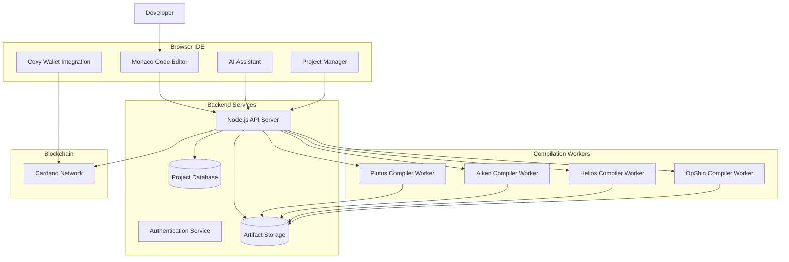
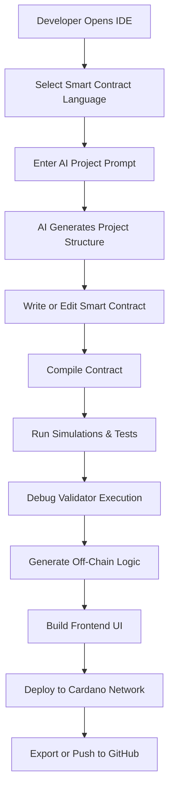
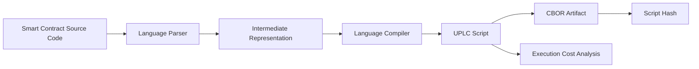
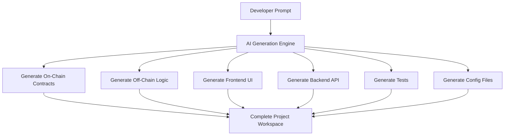
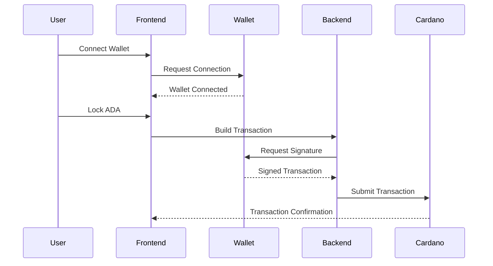
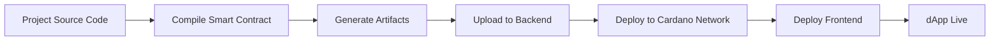
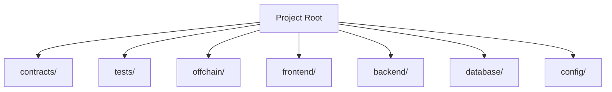
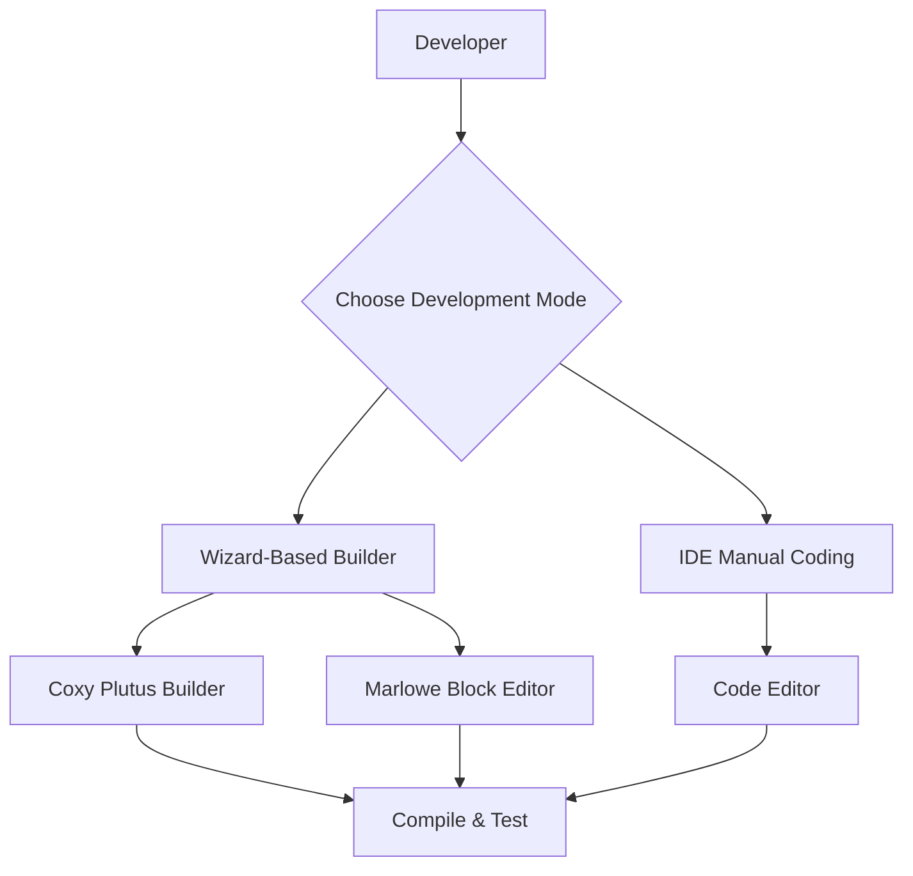
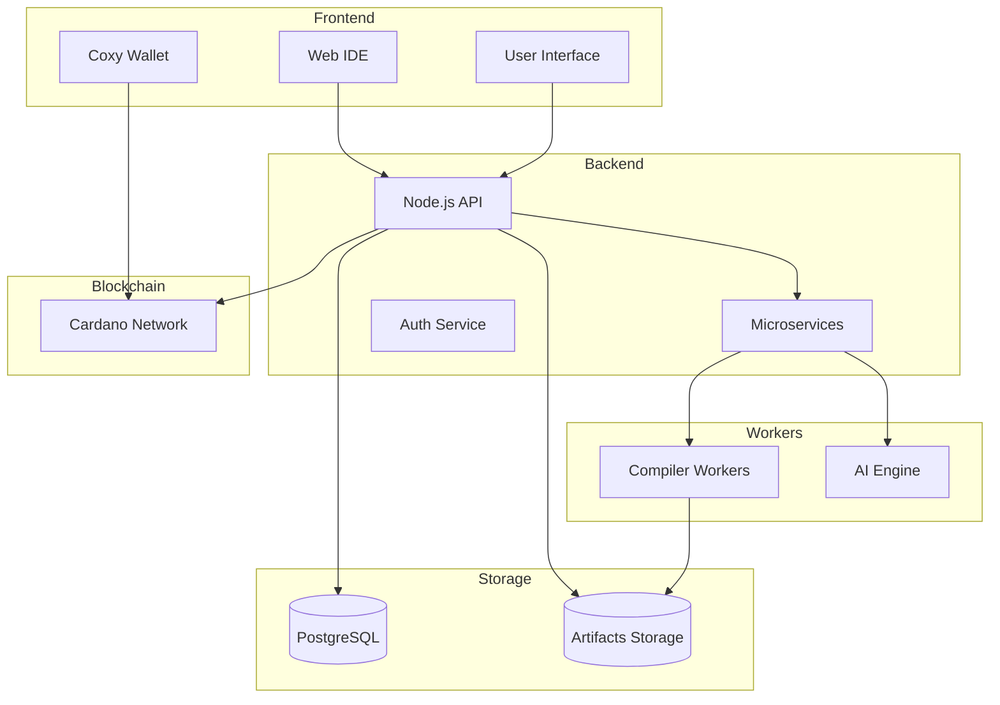
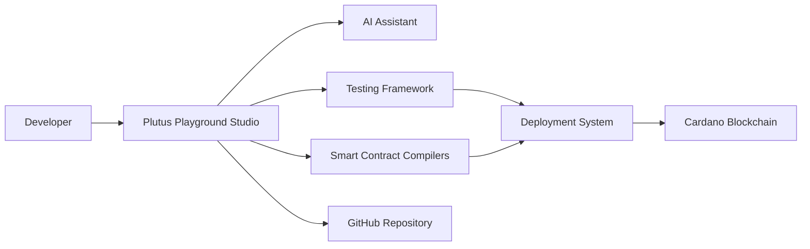

# Architecture Diagrams for Plutus Playground Studio

These diagrams illustrate the **core system architecture, services, and workflows** that implement the usability flow specification.

Below are **clear architecture and workflow diagrams** you can include in your GitHub README or documentation to explain **Plutus Playground Studio** visually.
These diagrams are written in **Mermaid**, which GitHub renders automatically.


```
Table of contents
│
├── Introduction
├── Features
├── Architecture Diagram
├── Developer Workflow
├── Compilation Pipeline
├── AI Project Generation
├── Smart Contract Interaction
├── Deployment Pipeline
├── Development Modes
├── Project Structure
├── Roadmap
```

---


# 1. System Architecture Diagram

This diagram shows how **frontend, backend, compilers, and blockchain interact**.



---

# 2. Developer Workflow Diagram

This explains **how developers use the platform step by step**.



---

# 3. Compilation Pipeline Diagram

This shows **how contracts are compiled internally**.



---

# 4. AI Project Generation Flow

This explains how **AI builds the entire project automatically**.



---

# 5. Smart Contract Interaction Diagram

This shows **how the frontend interacts with Cardano smart contracts**.



---

# 6. Deployment Pipeline

This explains how **dApps are deployed from the IDE**.



---

# 7. Project Directory Structure Diagram



---

# 8. Development Modes Diagram



---

# 9. Platform Component Architecture



---

# 10. Full Platform Overview



---

